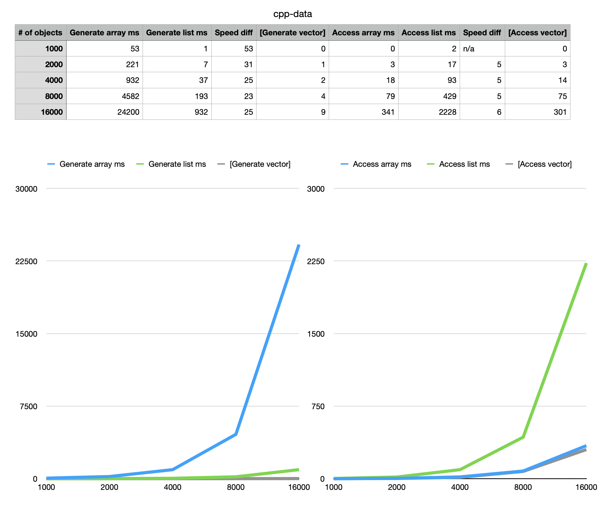

# Comparing Linked Lists and Arrays

This simple app creates a continuous array and a linked list. Both containers add the elements in *sorted order*. Creation of the containers are timed.

Then the app accesses random elements from both data structures in a simple linear way. Search starts from the beginning and compares if the item to search is found. Searches are timed. 

You can change the number of elements to generate using a command line argument when  you launch the app:

```
./ListArrayComparison 1000 5 cpp-data.tsv
```
This will run the comparison five times, first with 1000 numbers, then 2000, 4000, 8000 and finally 16000 numbers. Output will be saved to `cpp-data.tsv` file you can open with any spreadsheet app to see the comparison data.

If no parameter is give, a value of 4000 is used. Please note that large values (e.g. > 30000) take a long time, consume memory and makes your computer fans spin.

See the attached image of sample search numbers on my laptop. Compare those to yours.

The point of this exercise is to ponder why the different execution times with the different data structures. Note that the containers are not fully implemented, the focus is on 1) adding elements to container and 2) accessing elements from the container.

A binary search is also perfomed both on the array and the list. This enables you to compare the performance of the binary search with these two data structures.



## How to build and run

You'll need a C++17 compiler and CMake to get things running. Code should work on Windows, Linux and macOS.

1. Install [CMake](https://cmake.org) if not yet installed.
1. git clone the repo to your local computer.
1. In the command line, do `mkdir build` and `cd build`
1. `cmake -DCMAKE_BUILD_TYPE=Release ..` -- release build is important when measuring performance.
1. `make`
1. Run the app `ListArrayComparison` in the directory, giving a parameter for the count of numbers to generate and access.

## Who did this

(c) Antti Juustila 2020
INTERACT Research Group, University of Oulu, Finland

## License

License is MIT. See LICENSE for details.

